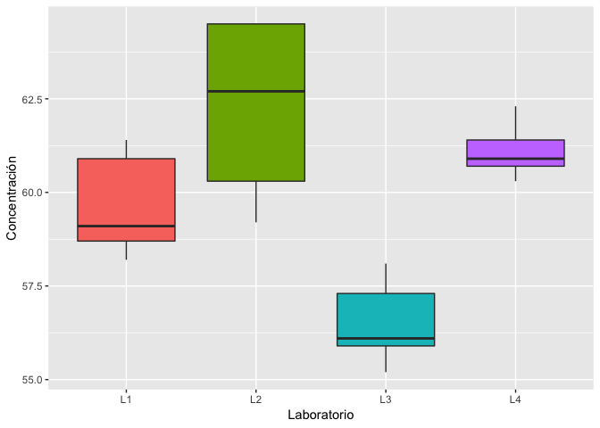

Diseño Experimental: Diseño completamente al azar
================

Ejercicio
---------

Se emplean cuatro laboratorios para efectuar análisis químicos. Se envían muestras del mismo material a los laboratorios para que, como parte del estudio, las analicen para determinar si dan o no, en promedio, los mismos resultados. Los resultados analíticos de los cuatro laboratorios son los siguientes:

|  L1  |  L2  |  L3  |  L4  |
|:----:|:----:|:----:|:----:|
| 58.7 | 62.7 | 55.9 | 60.7 |
| 61.4 | 64.5 | 56.1 | 60.3 |
| 60.9 | 64.5 | 57.3 | 60.9 |
| 59.1 | 59.2 | 55.2 | 61.4 |
| 58.2 | 60.3 | 58.1 | 62.3 |

### 1. Planteamiento del problema

Se desea conocer si existen diferencias significativas entre las mediciones de los 4 laboratorios. Posteriormente conocer entre que laboratorios hay diferencias, si las hay.

Las hipotesis son:

*H*<sub>0</sub>: No existen diferencias significativas entre las mediciones de los laboratorios (*μ*<sub>*j*</sub> = *μ*<sub>*j*</sub>', *j* ≠ *j*′)

*H*<sub>1</sub>: Hay diferencias significativas entre las mediciones de los laboratorios (*μ*<sub>*j*</sub> ≠ *μ*<sub>*j*</sub>', *j* ≠ *j*′).

### 2. Ingreso de datos

A continuación se ingresan los datos a R:

``` r
#Se crea un vector para cada laboratorio con los valores medidos
L1 <- c(58.7, 61.4, 60.9, 59.1, 58.2)
L2 <- c(62.7, 64.5, 64.5, 59.2, 60.3)
L3 <- c(55.9, 56.1, 57.3, 55.2, 58.1)
L4 <- c(60.7, 60.3, 60.9, 61.4, 62.3)
#Creamos un dataframe con los vectores
labs <- data.frame(L1, L2, L3, L4)
#Usamos la función gather del paquete tidyr para convertir las 4 columnas en una sola
library(tidyr)
laboratorios <- gather(labs)
names(laboratorios) <- c("lab", "concentracion")
print(laboratorios)
```

    ##    lab concentracion
    ## 1   L1          58.7
    ## 2   L1          61.4
    ## 3   L1          60.9
    ## 4   L1          59.1
    ## 5   L1          58.2
    ## 6   L2          62.7
    ## 7   L2          64.5
    ## 8   L2          64.5
    ## 9   L2          59.2
    ## 10  L2          60.3
    ## 11  L3          55.9
    ## 12  L3          56.1
    ## 13  L3          57.3
    ## 14  L3          55.2
    ## 15  L3          58.1
    ## 16  L4          60.7
    ## 17  L4          60.3
    ## 18  L4          60.9
    ## 19  L4          61.4
    ## 20  L4          62.3

### 3. Estadística descriptiva

A continuación se estiman medidas de tendencia central para cada laboratorio:

``` r
#La función summary nos muestra un resumen de los datos:
apply(labs, 2, summary)
```

    ##            L1    L2    L3    L4
    ## Min.    58.20 59.20 55.20 60.30
    ## 1st Qu. 58.70 60.30 55.90 60.70
    ## Median  59.10 62.70 56.10 60.90
    ## Mean    59.66 62.24 56.52 61.12
    ## 3rd Qu. 60.90 64.50 57.30 61.40
    ## Max.    61.40 64.50 58.10 62.30

``` r
#Varianza de cada laboratorio
apply(labs, 2, var)
```

    ##    L1    L2    L3    L4 
    ## 1.983 5.858 1.352 0.592

``` r
#Desviación estandar por laboratorio
apply(labs, 2, sd)
```

    ##        L1        L2        L3        L4 
    ## 1.4081903 2.4203306 1.1627553 0.7694154

### 4. Gráfico de cajas

A continuación se puede observar el diagrama de cajas:

``` r
library(ggplot2)
ggplot(laboratorios, aes(x = lab, y = concentracion, 
                         fill = as.factor(lab))) +
        geom_boxplot(show.legend = FALSE) + xlab("Laboratorio") +  
        ylab("Concentración")
```



### 5. Pruebas de supuestos

#### 5.1 Normalidad

Para verificar la normalidad de los datos usamos la prueba de Shapiro-Wilk, antes planteamos las hipotesis así:

*H*<sub>0</sub>: los datos siguen una distribución normal

*H*<sub>1</sub>: los datos no siguen una distribución normal

``` r
normalidades <- apply(labs, 2, shapiro.test)
print(normalidades)
```

    ## $L1
    ## 
    ##  Shapiro-Wilk normality test
    ## 
    ## data:  newX[, i]
    ## W = 0.89058, p-value = 0.36
    ## 
    ## 
    ## $L2
    ## 
    ##  Shapiro-Wilk normality test
    ## 
    ## data:  newX[, i]
    ## W = 0.8782, p-value = 0.3012
    ## 
    ## 
    ## $L3
    ## 
    ##  Shapiro-Wilk normality test
    ## 
    ## data:  newX[, i]
    ## W = 0.94894, p-value = 0.7296
    ## 
    ## 
    ## $L4
    ## 
    ##  Shapiro-Wilk normality test
    ## 
    ## data:  newX[, i]
    ## W = 0.94793, p-value = 0.7224

Los resultados indican que todas las mediciones de los 4 laboratorios siguen una distribución normal. En todos los casos el *p* − *v**a**l**o**r* fue mayor que 0.05, por tanto no se rechaza la hipótesis nula.

#### 5.2 Homocedasticidad

Para verificar la homocedasticidad de los datos usamos la prueba de Bartlett, antes planteamos las hipotesis así:

*H*<sub>0</sub>: las varianzas son iguales

*H*<sub>1</sub>: las varianzas son diferentes

``` r
varianzas <- bartlett.test(formula = concentracion ~ lab, 
                           data = laboratorios)
print(varianzas)
```

    ## 
    ##  Bartlett test of homogeneity of variances
    ## 
    ## data:  concentracion by lab
    ## Bartlett's K-squared = 4.885, df = 3, p-value = 0.1804

Con respecto a la homogeneidad de varianzas se encontró que las mediciones de los laboratorios tienen varianzas iguales. El *p* − *v**a**l**o**r* fue mayor de 0.05, por tanto no rechazamos la hipótesis nula.

### 6. Análisis de varianza

Para la realización del análisis de varianza se usó la función *a**o**v* del paquete *s**t**a**t**s* de R.

``` r
anova_labs <- aov(formula = concentracion ~ lab, data = laboratorios)
summary(anova_labs)
```

    ##             Df Sum Sq Mean Sq F value   Pr(>F)    
    ## lab          3  92.23  30.742   12.57 0.000178 ***
    ## Residuals   16  39.14   2.446                     
    ## ---
    ## Signif. codes:  0 '***' 0.001 '**' 0.01 '*' 0.05 '.' 0.1 ' ' 1

Los resultados del ANOVA muestran que el *p* − *v**a**l**o**r* es menor que 0.05, lo que indica que en al menos una de las comparaciones realizadas hubo diferencias significativas.

### 7. Prueba de comparación de medias

Para la comparación de medias entre laboratorios se usó la prueba de Tukey:

``` r
tukey_labs <- TukeyHSD(anova_labs, "lab", conf.level = 0.95)
print(tukey_labs)
```

    ##   Tukey multiple comparisons of means
    ##     95% family-wise confidence level
    ## 
    ## Fit: aov(formula = concentracion ~ lab, data = laboratorios)
    ## 
    ## $lab
    ##        diff        lwr        upr     p adj
    ## L2-L1  2.58 -0.2500967  5.4100967 0.0804761
    ## L3-L1 -3.14 -5.9700967 -0.3099033 0.0271362
    ## L4-L1  1.46 -1.3700967  4.2900967 0.4737338
    ## L3-L2 -5.72 -8.5500967 -2.8899033 0.0001492
    ## L4-L2 -1.12 -3.9500967  1.7100967 0.6757238
    ## L4-L3  4.60  1.7699033  7.4300967 0.0013707

### 8. Conclusión final y recomendaciones

Con base en los resultados obtenidos podemos concluir que existen diferencias significativas entre las mediciones realizadas en los 4 laboratorios. En la prueba de ANOVA el *p* − *v**a**l**o**r* arrojó un valor menor de 0.05, lo que indica que si existe tal diferencia. Con la prueba de Tukey pudimos conocer entre que laboratorios existen las diferencias. A continuación mostramos las parejas de laboratorios que presentaron diferencias significativas entre sus mediciones: L2-L1, L3-L1, L3-L2 y L4-L3.

Teniendo en cuenta los resultados estadísticos se recomienda una revisión de los procedimientos o técnicas que los laboratorios usan para determinar la concentración de los químicos. Se recomienda una estandarización de dichos procedimientos para que no exista una diferencia significativa entre las mediciones.
